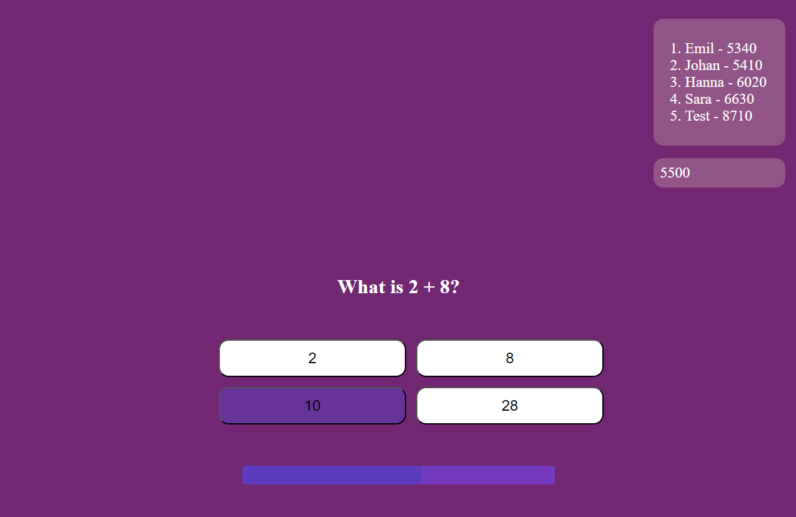

# A2 Quiz

## The app

The app consists of a single HTML page, styled with CSS and made working with JavaScript. The scripts included are for managing the questions, scoreboard (usernames and times) and timer.

## How to play

To play the game, clone the gitlab repository, install the devlelopment tools with "npm --install" and do "npm run serve" in a terminal opened in the repository.

## The rules

The rules are simple: enter your username, then you will be presented with questions you have to answer. Some are open questions, where you will have to type in the answer, while others are multichoice questions, where you will be presented four options. You can see the scoreboard on the top right, as well as your current score below. The score is represented by the milliseconds it took to complete the quiz. If your score is lower than any of the scoreboard scores, it will be put in the scoreboard in the corresponding position.

## Running linters

To run the linters, enter "npm run lint" in a terminal. (Here we assume that you have installed the development tools already from the "How to play" section).
