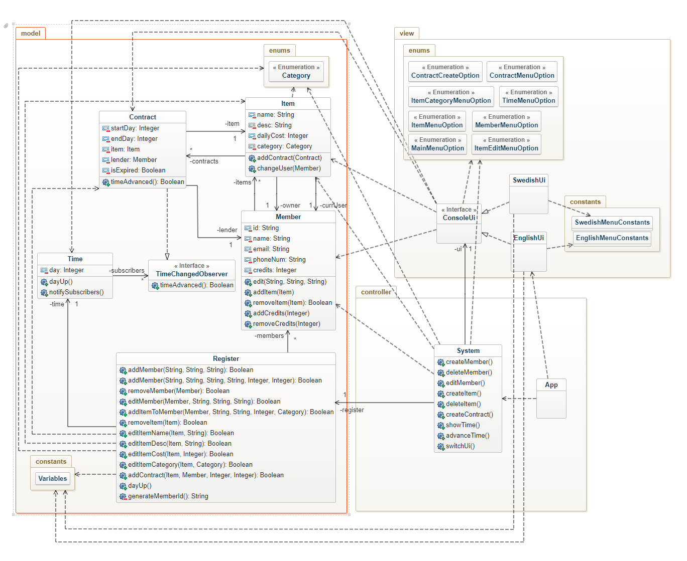
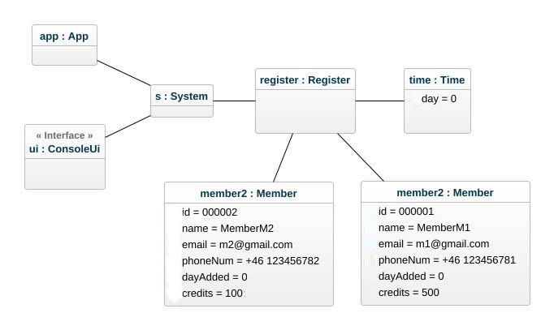
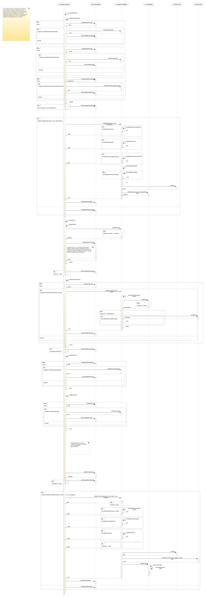

# Stuff Lending System OO-Design
This document describes the design according to the requirements presented in assignment 2.

## Architectural Overview
The application uses the model-view-controller (MVC) architectural pattern. The view is passive and gets called from the controller. The view may only read information from the model, not directly change it. The program follows some aspects of the general responsibility assignment software principles(GRASP). In our case **controller.System** takes place as the *Creator* and *Controller*. **System** was assigned the role *Creator* since it has access to all other classes and it interacts with them with the need-to know basis and the user inputs from the **ui** were being stored on the **System** class which are as well necesarry to create other class instances. *Creator* was also assigned to the **System** since the **System** class represents the overall system *(System acts as a facade controller)*. One drawback regarding the application using **System** class so often makes average *coupling* and at some points may not be the best idea for *high cohesion*, however this way was chosen in order to keep the rest of the classes *reusable* and *easier to understand* as most of the classes that were used from the **System** were *model classes* which we didn't really want to assign so many responsibilities and instead keep *low coupling* and *high cohesion* within these *business model classes*. As we all know to make something better on a program we have to sacrifice another thing, so our sacrificition was to make **System** class a little more buffered while trying to keep *model classes* simpler to understand and to make it possible to *reuse* them as much as possible. That all said we believe that it was a good and worthy gamble. We could have followed *Pure Fabrication* as well to assign these classes who violate the *cohesion* and *coupling* with assigning methods to these classes however, it was going to make the program only more harder to follow and more complex.

## Detailed Design
### Class Diagram
Class diagram was made respecting the MVC pattern. There are dependencies going to the model, however model itself does not have any dependencies to view nor to the controller package.

### Object Diagram
Object diagram where we were asked to add 3rd member namely Allan Turner.

### Sequence Diagram
Same case was followed for the sequence diagram as well.

